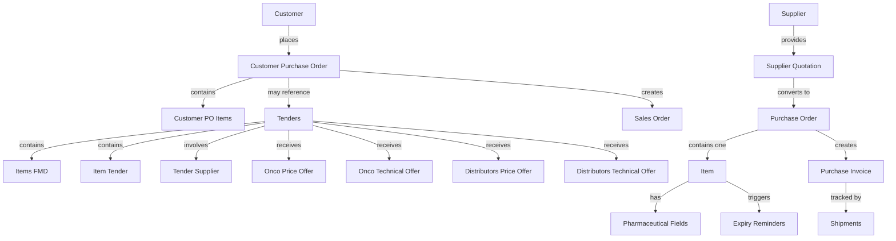

# Onco Frappe/ERPNext Application Documentation

## Application Overview

**App Name:** Onco  
**Module:** Onco  
**Description:** Pharmaceutical import and tender management system for Oncopharm  
**License:** MIT

## Application Structure

```
Onco/
├── onco/
│   ├── hooks.py                 # Application hooks and configurations
│   ├── tasks.py                 # Scheduled tasks (expiry reminders)
│   ├── modules.txt              # Module definition
│   ├── patches.txt              # Database patches
│   ├── onco/                    # Main module directory
│   │   ├── purchase_order.py    # Custom Purchase Order class
│   │   ├── doctype/             # Custom doctypes
│   │   └── custom/              # Custom fields for standard doctypes
│   ├── public/                  # Static files
│   │   └── js/
│   │       └── p_inv.override.js  # Purchase Invoice overrides
│   └── templates/               # Print templates
```

## Custom Doctypes

### 1. Tenders
**Purpose:** Manage pharmaceutical tenders from hospitals and agencies

**Key Fields:**
- `naming_series`: Auto-naming based on tender type
  - TNDR-FMD-.YYYY.-.#### (For Market Data)
  - TNDR-AWR-UPA-.YYYY.-.{tender_number}. (Awarded UPA)
  - TNDR-AWR-PRV-.YYYY.-.{tender_number}. (Awarded Private)
  - TNDR-ACP-UPA-.YYYY.-.{tender_number}. (Accepted UPA)
  - TNDR-ACP-PRV-.YYYY.-.{tender_number}. (Accepted Private)
- `tender_type`: Tenders for market data | Awarded Tenders | Accepted Tenders
- `category`: UPA Tender | Private Tender
- `tender_number`: External tender reference
- `year_of_tender`: Year of tender
- `hospitalagent_name`: Link to Customer (tender issuer)
- `date`: Tender date
- `tender_start_date`: Start date
- `tender_end_date`: End date
- `supplying_by`: Oncopharm | Distributor | Oncopharm & Distributor

**Child Tables:**
- `items_fmd`: For market data tenders
- `item_tender`: For awarded tenders
- `tender_supplier`: For accepted tenders and distributor involvement

**Offers Tab:**
- `onco_price_offer`: Oncopharm price offers
- `onco_technical_offer`: Oncopharm technical offers
- `distributors_price_offer`: Distributor price offers
- `distributors_technical_offer`: Distributor technical offers
- HTML views for displaying offers

**Features:**
- Submittable document
- Dynamic child table display based on tender type
- Separate tabs for offers management

---

### 2. Customer Purchase Order
**Purpose:** Track customer purchase orders (CPO) from hospitals/distributors

**Key Fields:**
- `naming_series`: 
  - CPO-PRV-DIR-.#####.-.FY.-.{customer_purchase_order_number}.
  - CPO-PRV-TEN-.#####.-.FY.-.{customer_purchase_order_number}.
  - CPO-UPA-TEN-.#####.-.FY.-.{customer_purchase_order_number}.
  - CPO-UPA-DIR-.#####.-.FY.-.{customer_purchase_order_number}.
  - CPO-UPA-DIS-.#####.-.FY.-.{customer_purchase_order_number}.
- `customer_purchase_order_number`: External PO reference
- `sales_type`: Sales | Sales Maintenance | Shopping Cart
- `order_type`: Private Direct Order | Private Tenders Order | UPA Tender Order | UPA Direct Order | UPA Distributor Order
- `tender`: Link to Tenders (conditional)
- `requested_to`: ONCO | EGY
- `implemented_by`: Onco | Distributor
- `customer_type`: Distributor | Final Customer
- `date`: Order date
- `delivery_date`: Expected delivery
- `customer_main_group`: Link to Customer Group
- `customer_group`: Link to Customer Group
- `customer`: Link to Customer
- `tax_id`: Fetched from customer
- `customer_currency`: Link to Currency
- `price_list`: Link to Price List

**Child Table:**
- `customer_po_items`: Items with quantity, price, amount, ordered_qty

**Features:**
- Submittable document
- Links to Sales Order via custom_customer_po field
- Tracks ordered quantity vs requested quantity

---

### 3. Supplier Quotation (Acting as Importation Approval / EDA-IMAR)
**Purpose:** Dual purpose: Standard supplier quotation AND Importation Approval Request (EDA-IMAR).
**Discovery:** This doctype has been heavily customized to MATCH the `importation cycl.html` requirements.

**Validation:**
- **Naming Series:** `EDA-SPIMR-`... and `EDA-APIMR-`... (Verified in custom fields)
- **Status:** Custom field `custom_importation_status` (Totally/Partially Approved, Refused).

**Key Custom Fields (EDA Specific):**
- `custom_spimr_no`: EDA SPIMR Number
- `custom_apimr_no`: EDA APIMR Number
- `custom_year_plan`: Year Plan (for Annual requests)
- `custom_importation_date`: Date of importation request
- `custom_importation_status`: Approval status linked to workflow
- `aim_of_extend_`: For extension requests (Validation/Others)
- `aim_of_modify`: For modification requests (Error/Change data)
- `custom_importation_approval_ref`: Link to original Importation Approval (for extensions/modifications)

**Workflow:**
- Supports standard Quotation workflow.
- Supports EDA Approval workflow: Pending -> Totally/Partially Approved.
- Recursive linking for Extensions and Modifications (New Doc linked to Old Doc).

---

### 4. Shipments
**Purpose:** Track import shipment status through customs and banking

**Key Fields:**
- `purchase_invoice`: Link to Purchase Invoice
- `awb`: Air Waybill attachment
- `invoice`: Invoice attachment
- `certificate_of_analysis`: COA attachment
- `certificate_of_origin`: COO attachment
- `certificate_of_euro_1`: EUR1 attachment
- `certificate_of_insurance`: Insurance certificate attachment
- `invoice_no`: Invoice number
- `invoice_date`: Invoice date
- `batch_no`: Batch number
- `expiry_date`: Product expiry
- `manufacturing_date`: Manufacturing date
- `awb_no`: AWB number
- `awb_date`: AWB date

**Status Tracking Sections:**
1. **Shipment Acceptance** - Document uploads
2. **Arrival Status** - `arrived` checkbox, `arrivail_date`
3. **Bank Authentication** - `bank_authenticated` checkbox, `bank_authenticating_date`
4. **Restricted Release** - `restricted_release_status` checkbox, `restricted_release_date`
5. **Customs Release** - `customs_release_status` checkbox, `customs_release_no`, `customs_release_date`

**Additional Info:**
- `instructions`: Text field
- `is_internal_supplier`: Checkbox
- `remarks`: Text field

**Features:**
- Submittable document
- Multi-stage approval workflow
- Document management for import compliance

---

### 5. Items FMD (Child Table)
**Purpose:** Items for market data tenders

**Fields:**
- `item`: Item name (Data)
- `quantity`: Float
- `existing_supplier`: Data

---

### 6. Item Tender (Child Table)
**Purpose:** Items in awarded tenders

**Fields:**
- `item_group`: Link to Item Group
- `item_code`: Link to Item
- `item_name`: Fetched from item
- `tender_qty`: Float
- `tender_start_date`: Date
- `tender_end_date`: Date

---

### 7. Customer PO Items (Child Table)
**Purpose:** Line items in customer purchase orders

**Fields:**
- `item`: Link to Item
- `item_name`: Fetched from item
- `quantity`: Float
- `price`: Currency
- `amount`: Currency
- `ordered_qty`: Float (read-only, tracks fulfillment)

---

### 8. Tender Supplier (Child Table)
**Purpose:** Supplier information for tenders

**Fields:**
- (Structure to be documented from JSON)

---

### 9-12. Offer Child Tables
**Purpose:** Store price and technical offers from Oncopharm and distributors

- **Onco Price Offer**
- **Onco Technical Offer**
- **Distributors Price Offer**
- **Distributors Technical Offer**

---

## Custom Fields on Standard Doctypes

### Item Customizations

**Pharmaceutical Tracking:**
- `custom_pharmaceutical_item`: Check - Marks item as pharmaceutical
- `custom_registered`: Check - Registration status (depends on pharmaceutical_item)
- `custom_manufacturing_date`: Date - Manufacturing date
- `custom_expiry_date`: Date - Expiry date (mandatory if registered)
- `custom_reminder`: Select - Reminder period (Day, Month, Two Months, Six Months, Year)

**Pricing & Discounts:**
- `another_discount`: Percent
- `bonus`: Percent
- `discount_distribution`: Percent
- `discount_pharmacy`: Percent

**Import & Customs:**
- `custom_customs_rate`: Percent - Customs duty rate
- `producing_company`: Data - Manufacturer name

**Other:**
- `hub_sync_id`: Data (hidden, system-generated)

### Purchase Order Customizations

**Import Management:**
- `aian`: Data (hidden) - Import number
- `origin_of_goods`: Data (hidden)
- `source_of_supply`: Data (hidden)
- `incoterms`: Data (hidden)
- `port_of_destination`: Data (hidden)

**Order Classification:**
- `po_type`: Select - Cash In Advance | LC | Collection
- `item_group`: Link to Item Group

**Supplier Quotation Integration:**
- `get_item_from_imp`: Section Break (collapsible)
- `item`: Link to Item
- `search_in_imp`: Button
- `supplier_quotation_item`: Table (Supplier Quotation Item)
- `insert_to_po`: Button

### Purchase Invoice Customizations
- Custom JavaScript override in `p_inv.override.js`
- (Specific customizations to be documented)

### Sales Order Customizations
- `custom_customer_po`: Link to Customer Purchase Order

### Purchase Order Item Customizations
- (Custom fields to be documented from JSON)

### Sales Order Item Customizations
- (Custom fields to be documented from JSON)

---

## Business Logic & Automations

### 1. Custom Purchase Order Naming
**File:** `onco/onco/purchase_order.py`

**Class:** `CustomPurchaseOrder`

**Naming Format:** `PO-YYYY-XXXX-ZZZ`
- YYYY: Year from transaction_date
- XXXX: Sequential count of POs in that year (4 digits, zero-padded)
- ZZZ: Count of times this item has appeared in any PO (3 digits, zero-padded)

**Logic:**
- Validates at least one item exists
- Extracts item_code from first item
- Counts existing POs for the year
- Counts existing POs containing this item
- Generates unique name

**Constraint:** Each Purchase Order should contain exactly one item

---

### 2. Pharmaceutical Expiry Reminders
**File:** `onco/tasks.py`

**Function:** `send_expiry_reminders()`

**Schedule:** Daily (configured in hooks.py)

**Process:**
1. Queries all Items where:
   - `custom_pharmaceutical_item` = 1
   - `custom_registered` = 1
   - `custom_expiry_date` is set
   - `custom_reminder` is set

2. For each item:
   - Calculates reminder date based on reminder period
   - Checks if today matches reminder date
   - Sends notification to System Managers

**Reminder Periods:**
- Day: 1 day before expiry
- Month: 30 days before expiry
- Two Months: 60 days before expiry
- Six Months: 180 days before expiry
- Year: 365 days before expiry

**Notification:**
- Creates Notification Log
- Subject: "Pharmaceutical Item Expiry Alert: {item_name}"
- HTML formatted email content
- Sent to all enabled System Managers
- Includes: Item Code, Item Name, Expiry Date, Days Until Expiry, Reminder Period

---

## Application Hooks

**File:** `onco/hooks.py`

### DocType Overrides
```python
override_doctype_class = {
    "Purchase Order": "onco.onco.purchase_order.CustomPurchaseOrder"
}
```

### DocType JavaScript
```python
doctype_js = {
    "Purchase Invoice": "public/js/p_inv.override.js"
}
```

### Scheduled Tasks
```python
scheduler_events = {
    "daily": [
        "onco.tasks.send_expiry_reminders"
    ]
}
```

---

## Workflows

### Tender Management Workflow
1. **Market Data Collection** (TNDR-FMD)
   - Create tender with type "Tenders for market data"
   - Add items to `items_fmd` table
   - Track existing suppliers

2. **Awarded Tender** (TNDR-AWR)
   - Create tender with type "Awarded Tenders"
   - Specify category (UPA/Private)
   - Add items to `item_tender` table
   - Specify supplying method
   - Add suppliers if needed
   - Submit price and technical offers

3. **Accepted Tender** (TNDR-ACP)
   - Create tender with type "Accepted Tenders"
   - Link suppliers in `tender_supplier` table
   - Finalize offers

### Customer Order Workflow
1. **Customer PO Receipt**
   - Create Customer Purchase Order
   - Select order type and sales type
   - Link to tender if applicable
   - Add items with quantities and prices

2. **Sales Order Creation**
   - Create Sales Order
   - Link to Customer Purchase Order via `custom_customer_po`
   - Track ordered quantities

3. **Fulfillment Tracking**
   - Update `ordered_qty` in Customer PO Items
   - Monitor fulfillment status

### Import Workflow
1. **Purchase Order Creation**
   - Create PO with custom naming
   - One item per PO
   - Specify PO type (Cash/LC/Collection)

2. **Supplier Quotation**
   - Receive quotations
   - Compare prices
   - Select supplier

3. **Purchase Invoice**
   - Create PI from PO
   - Custom JavaScript handling

4. **Shipment Tracking**
   - Create Shipment document
   - Link to Purchase Invoice
   - Upload documents (AWB, Invoice, Certificates)
   - Track status through stages:
     - Arrival
     - Bank Authentication
     - Restricted Release
     - Customs Release

---

## Roles & Permissions

### Tenders
- **System Manager**: Full access
- **secretary**: Full access (create, read, write, submit, cancel, delete)

### Customer Purchase Order
- **System Manager**: Full access

### Shipments
- **System Manager**: Full access

---

## Data Relationships



---

## Key Business Rules

1. **One Item Per Purchase Order**
   - Each PO must contain exactly one item
   - Enforced in CustomPurchaseOrder.autoname()

2. **PO Naming Convention**
   - Format: PO-YYYY-XXXX-ZZZ
   - Tracks both year sequence and item frequency

3. **Pharmaceutical Item Tracking**
   - Items marked as pharmaceutical must have registration status
   - Registered items must have expiry date and reminder period
   - Daily automated reminders sent before expiry

4. **Tender Types**
   - Market Data: For price research only
   - Awarded: Tenders won by Oncopharm
   - Accepted: Tenders accepted and in execution

5. **Customer PO Types**
   - Private Direct: Direct sales to private customers
   - Private Tender: Sales through private tenders
   - UPA Tender: Sales through UPA tenders
   - UPA Direct: Direct sales to UPA
   - UPA Distributor: Sales through distributors to UPA

6. **Shipment Tracking**
   - Multi-stage approval process
   - Document management for compliance
   - Status tracking through customs clearance

---

## Technical Notes

### Database
- Uses Frappe ORM
- MariaDB/MySQL backend
- Standard ERPNext schema with customizations

### Frontend
- Frappe Desk UI
- Custom JavaScript for Purchase Invoice
- HTML views for tender offers

### Backend
- Python 3.10+
- Frappe Framework ~15.0.0
- Custom document controllers
- Scheduled background tasks

### Deployment
- Managed by Frappe Bench
- Development dependencies in pyproject.toml

---

## Next Steps for Analysis

1. **Parse HTML Requirements**
   - Extract business processes from Tender.html
   - Extract business processes from importation cycl.html

2. **Gap Analysis**
   - Compare existing functionality with requirements
   - Identify missing doctypes
   - Identify missing fields
   - Identify missing workflows

3. **Implementation Planning**
   - Prioritize development tasks
   - Define implementation sequence
   - Create detailed technical specifications
