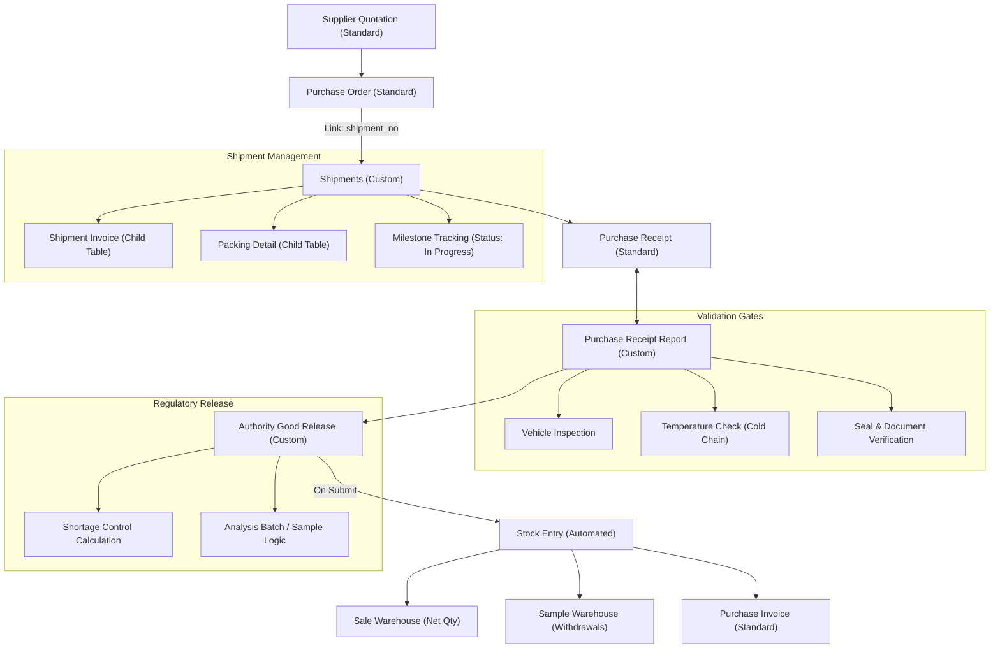

# Importation Cycle Workflow
This guide tracks the journey from initial quotation to final warehouse release, including cold chain and regulatory checks.

## Visual Workflow

## Step-by-Step Testing
1.  **Initial Purchase**: Create a `Purchase Order`. Ensure you fill the `custom_shipment_no` field.
2.  **Create Shipment**: Go to `Shipments`, create a new record. Link it to your PO. Add data to the `Packing Details` (Pallets/Cartons) and `Invoices` tables.
3.  **Receive Goods**: Create a `Purchase Receipt` from the PO.
4.  **Quality Inspection**: Open `Purchase Receipt Report`. Check that it correctly links to your Receipt. Fill in the Vehicle and Temperature details. If temperature is out of range, ensure "Supplier Notified" is filled.
5.  **Final Release**: Create an `Authority Good Release` (AGR). 
    -   Click "Fetch Items". It will pull from the `Purchase Receipt Report`.
    -   Enter `Released Qty` and `Actual Qty`. Verify `Net Released Qty` calculates correctly.
    -   Submit the AGR. Check `Stock Entry` to see if goods moved from "Under Release" to "Sales Warehouse".
