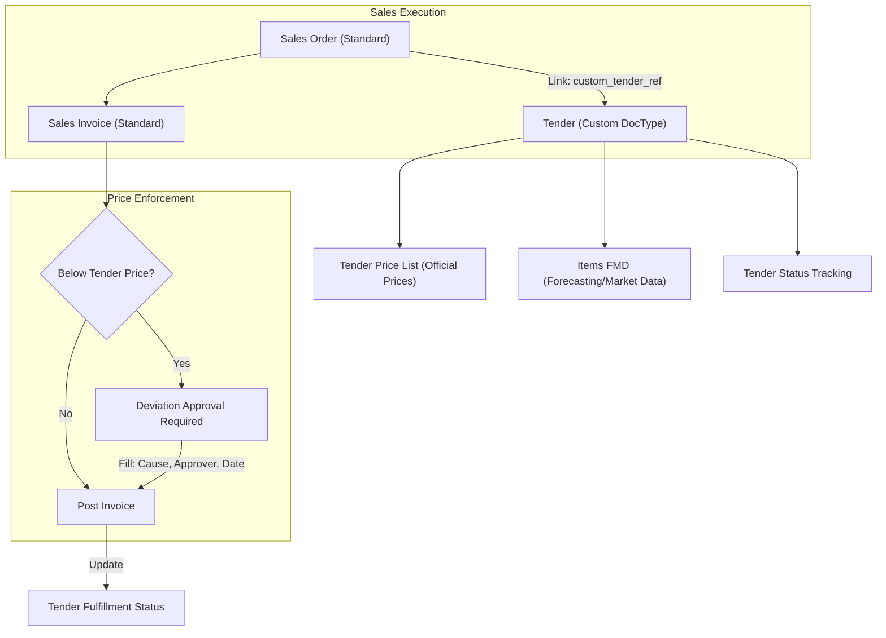

# Tender Cycle Workflow
This guide manages official price lists, forecasting, and enforces pricing rules during sales.

## Visual Workflow

## Step-by-Step Testing
1.  **Setup Tender**: Create a `Tender`. Link multiple `Price Lists` in the child table. Add items to the `Items FMD` (use text names for forecasting if item codes aren't ready).
2.  **Sales Order**: Create a `Sales Order`. Select your `Tender Reference`.
3.  **Invoice Validation**: Create a `Sales Invoice`.
    -   Try to set a rate **lower** than the tender price.
    -   Try to save/submit. The system should block you, demanding "Cause of Deviation" and "Approved By".
    -   Fill these fields and submit.
4.  **Fulfillment Check**: Go back to the `Tender` record. Verify that the "Fulfillment Status" and "Losses Value" in the technical deviation table have updated based on the invoice.
